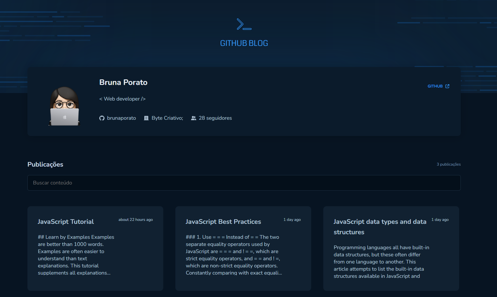

# GitHub Blog



## Overview

This is a web blog project that transforms repository issues into engaging blog posts. This platform utilizes React, React Router DOM, Axios, React Markdown, Styled Components, TypeScript and Github API to create a seamless and dynamic blogging experience.

## Features

- GitHub Integration: Fetches repository issues using the GitHub API.

- Dynamic Content: Automatically converts fetched issues into user-friendly blog posts.

- React-Powered: Built with React for a responsive and interactive user interface.

- Routing: Utilizes React Router DOM for smooth navigation between blog posts.

- Markdown Support: Renders GitHub-flavored Markdown for clear and consistent content display.

- Styled Components: Implements Styled Components for a sleek and customizable design.

- TypeScript: Enhances code maintainability and development efficiency.

## Getting Started

Clone the Repository:

```
git clone https://github.com/brunaporato/github-blog.git
cd github-issues-blogger
```
Install Dependencies:

```
npm install
```
Run the App:

```
npm run dev
```

## Contributing

Contributions are welcome! If you're interested in contributing to the project, please contact me.

<!-- <small> -->

made with ❤️ by  [brunaporato](https://linkedin.com/in/brunaporato)
